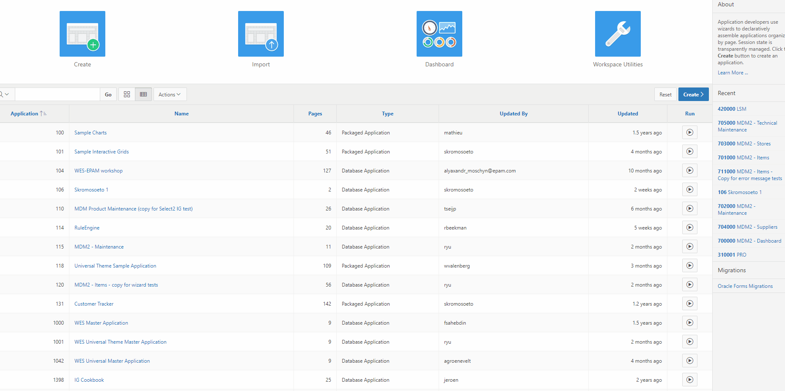

# Nieuwe Applicatie
Creeer een nieuwe applicatie. 
Navigeer naar de Application Builder en klik op de Create knop. 
Type Applicatie = Desktop 
Applicatie naam = Workshop EMP DEP  
Theme = Universal Theme  
Zorg ervoor dat de authentication scheme op APEX accounts is ingesteld 
Je kunt dan inloggen met de APEX gebruikers gegevens. 
Doe dit via "Shared Components" → "Authentication Schemes". 
Het resultaat is een applicatie met twee schermen: De login page en het hoofdscherm, page 1. 

## Nieuwe applicatie

## Authentication scheme
Als de apex authenticatie nog niet bestaat maak, dan eentje aan via de "Create" knop. 

