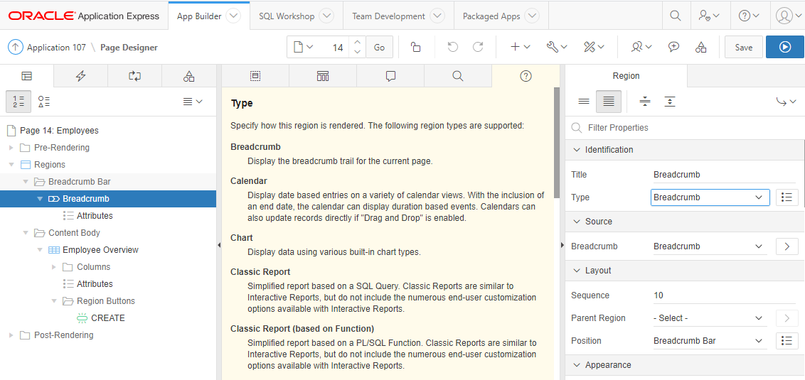
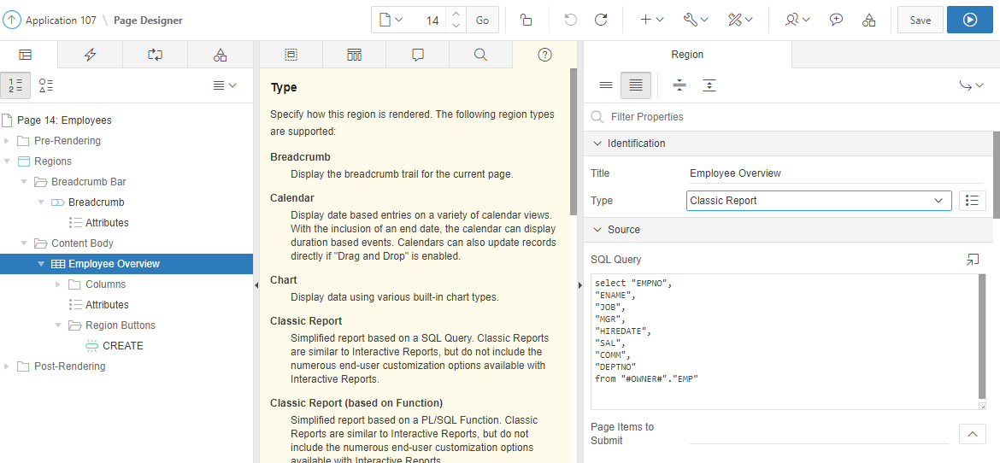
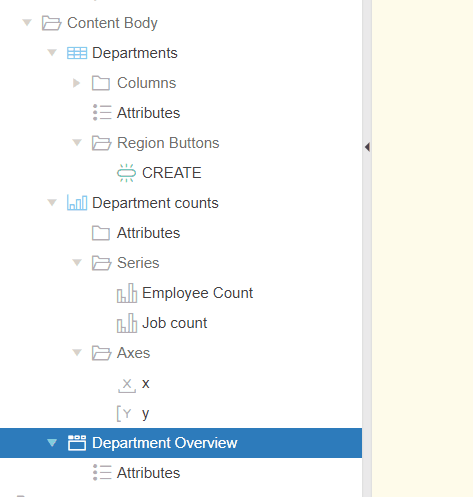
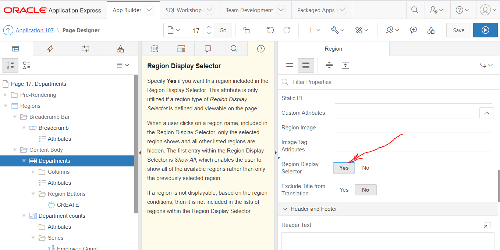
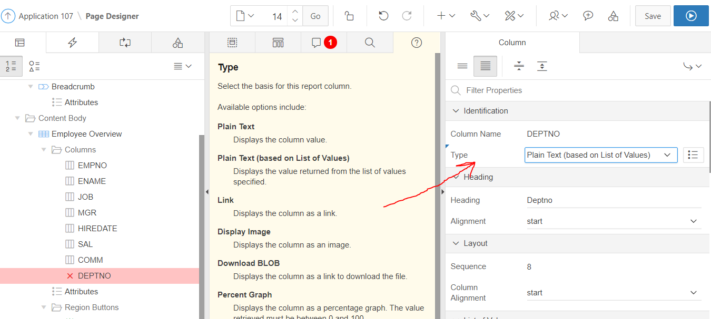

# Component types
In APEX zijn componenten zoals Regions, Items, LOV's, Lists opgedeeld in verschillende typen. Het gekozen type verandert het gedrag en de mogelijke attributen drastisch.</br>
Bijvoorbeeld op het Employees overzicht (Classic Report) de <b>Breadcrumb</b> en <b>Classic Report</b> region.</br>
Bij de Classic report region kun je een query invoeren.
</br>
</br>
</br>
</br>
Tip: raadpleeg de Help tab nadat je een attribuut selecteert.
</br>
In deze module zullen we enkele typen regions en items implementeren.
</br>

## Chart region
Navigeer naar een overzicht voor departments. We gaan in dit scherm een grafiek toevoegen.
1. Voeg een region toe m.b.v. een rechtermuisklik in de page designer van het Departments overzicht (Classic Report)
  - rechtermuisklik op Content body in tab "Rendering"
  - kies Create new region
2. Bij de properties, geef de naam "Department counts" en kies voor type = "Chart"
3. SQL Query: </br>
```SQL
select (select count(1)
        from   emp e2
        where  e2.deptno = d.deptno
        ) "Employee count"
,      (select count(distinct(job))
        from   emp e2
        where  e2.deptno = d.deptno
        ) "Job count"
,      d.dname "Department"
from   dept d
;
```
4. Voeg twee series toe:
- Name = Employee Count, Source Type = Region Source, Label = "Department", Value = "Employee count"
- Name = Department Count, Source Type = Region Source, Label = "Department", Value = "Department count"
5. Save en run

## Region Display Selector (RDS)
Op hetzelfde scherm waar je een grafiek hebt toegevoegd gaan we een RDS plaatsen. </br>
1. Wijzig de naam van de Departments classic reports naar "Departments" ipv Report 1.
2. Voeg een region toe:
  - Title = "Department Overview"
  - Type = Region Display Selector
3. Zorg ervoor dat deze nieuwe region de eerste in de Conten body is door hem naar boven te slepen.</br>
</br>

</br>
4. Wijzig, indien nodig de properties van de twee andere regions: "Departments" en "Department counts": Region Display Selector = "Yes"</br>
</br>

</br>

## List of Values (LOV)
In de applicatie word nu department number (deptno) getoond en verwerkt. Dit gaan we wijzigen door een LOV te gebruiken. We kiezen ervoor om een algemene LOV aan te maken in Shared Components.
### LOV aanmaken in shared components
1. navigeer naar Shared Components → List of values → klik op Create
2. From scratch (klik next) → Name = DNAME_RET_DEPTNO, Type = Dynamic (klik next)
3. Vul als Query in:
```SQL
select dname as d,
       deptno as r
  from dept
 order by 1
 ```
 </br> Klik Create
 </br> de LOV is nu aangemaakt en kan gebruikt worden

 ### Gebruik maken van een LOV in Shared Components
1. Navigeer naar een Employees formulier en open deze in page designer.
2. Wijzig het type van P15_DEPTO (nummer kan verschillen) van "Number field" naar "Select List"
3. Kies voor List Of Values type = "Shared Component" en dan "DNAME_RET_DEPTNO"
4. Save en run
5. Navigeer naar een Employees classic report en open deze in page designer.
6. Wijzig het kolomtype van kolom DEPTNO naar "Plain Text(Based on List of Values)"</br>
</br>
7. Kies voor List Of Values type = "Shared Component" en dan "DNAME_RET_DEPTNO"
8. Save en run

## Opmerkingen
- APEX heeft andere shared components aangemaakt tijdens het genereren van de schermen via de wizard. Zoek de verwijzing naar shared components in het scherm.
- Je kunt de applicatie zelf importeren als naslag.
 