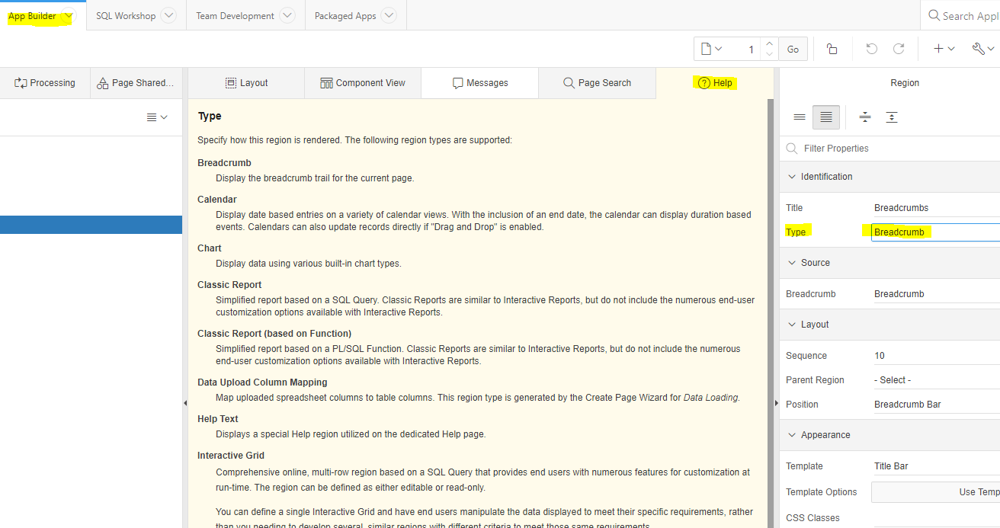

# Basics
In deze module behandelen we enkele basis functionaliteiten. Verder bekijken we basis Apex componenten, component types en templates 
## applicatie
De [voorbeeld applicatie](f107.sql) kun je uit deze map downloaden en importeren. Deze applicatie is het resultaat van alle instructies in deze module.
 

# Help!
 
Gebruik de help optie in de application builder. Hierin staan vaak uitgebreide omschrijvingen en soms voorbeeld code. Ook is er een undo optie in de page designer die je kunt gebruiken als je nog niet hebt opgeslagen.
 

