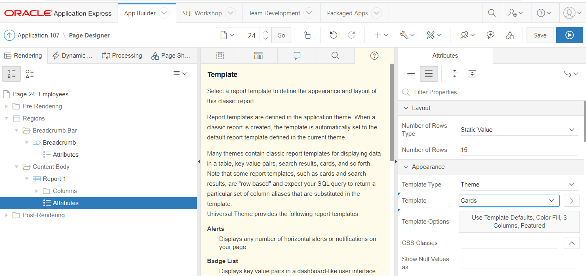

# Component Attributes
Met Component attributes kunnen we de look and feel van componenten veranderen.</br>
Bijvoorbeeld de region display selector:</br>
Navigeer in je applicatie naar het scherm met een region display selector (Departments CR) en open die in de page designer. </br>
Klik bij de RDS op Attributes en wijzig:
- Mode = Scroll Window → save en run </br>
Wijzig terug naar
- Mode = View Single Region
- Include 'Show All' = No → save en run

## Classsic Report Attributes
De classic report is één van de meest veelzijdige regions. We gaan dit uittesten door opnieuw een classic report te maken en de template te wijzigen in de Region attributes.</br>
1. Wijzig eerst de "normale" Classic Report. Navigeer naar Employees (CR) en open die in de page designer.
- Klik op Attributes en daarna in de properties op Template Options
- Vink "Stretch Report" aan.
- Save and run
### Cards
</br>
Navigeer in de Universal Theme Applicatie → Component → Cards → Examples → Report Examples (of Report Template Customization) . We gaan medewerkers overzicht in cards tonen.</br>
Maak een nieuwe classic report:

2. Open de create page wizard en kies voor report → classic report
3. Page Name = Employees, page Mode = Normal, Breadcrumb, Entry Name = Employees, klik NEXT
4. Navigation Entry = Employees (Cards), klik NEXT. Run het scherm nadat het is gegenereerd
### Wijzig de template in de Attributes
5. Klik op Attributes onder de report region en wijzig de Template naar "Cards"
</br>

</br>

6. Wijzig de report query naar:
```SQL
select EMPNO,
       ENAME                           card_title,
       apex_string.get_initials(ENAME) card_initials,
       JOB                             card_text,
       MGR,
       HIREDATE                        card_subtext,
       SAL,
       COMM,
       DEPTNO
  from EMP
  ```
  ### Save and run
  6. Wijzig de Template options:
    - Apply theme colors aanvinken
    - Icons = Display initials
    - Layout = 5 columns
    - Animation = raise card
