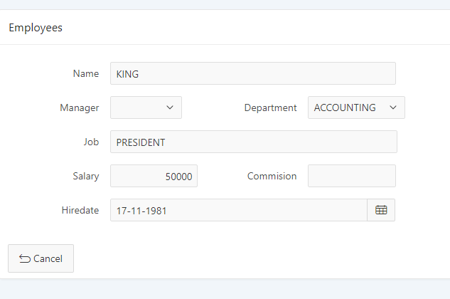

# Layout Columns
Universal Theme gebruikt een flexibel GRID met 12 kolommen voor het rangschikken van paginacomponenten. 
Navigeer in de UT applicatie → Design → Layout → Grid Layout </b>
De layout columns kun je ook zien door in de developer toolbar op "Show Layout Columns" te klikken. 
Deze kolominformatie gebruik je in de laypou properties van APEX componenten. 
Navigeer in je applicatie naar je Employees Formulier en open het scherm in de page designer 
- Zorg ervoor dat de invulvelden dichter bij de veldnamen komen te staan door de span van de label te wijzgen naar 1.
- Wijzig de velden zodanig dat je onderstaande layout hebt. (hoeft niet exact hetzelfde te zijn) 
