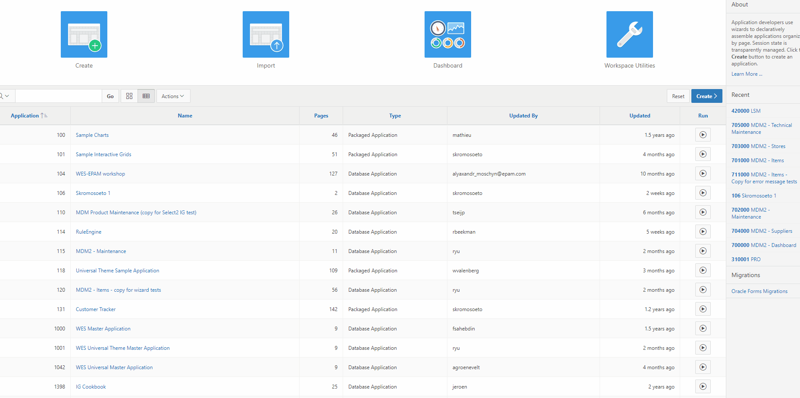

# Intro

Run [empDep.sql](db/empDep.sql) om de tabellen te creeren en data in te voeren. Gebruik TOAD of de APEX SQL Workshop.

## intro
Creeer een nieuwe applicatie. 
Navigeer naar de Application Builder en klik op de Create knop. 
Type Applicatie = Desktop 
Applicatie naam = Workshop EMP DEP  
Theme = Universal Theme  
 

